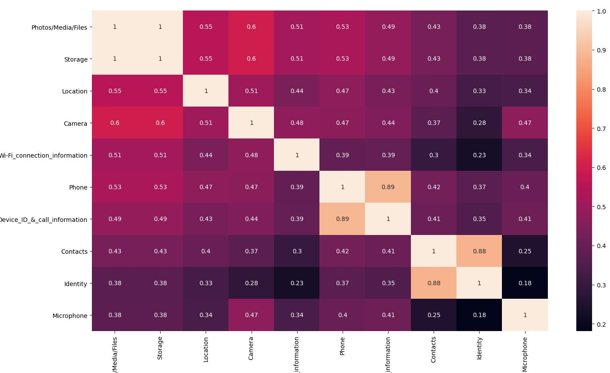
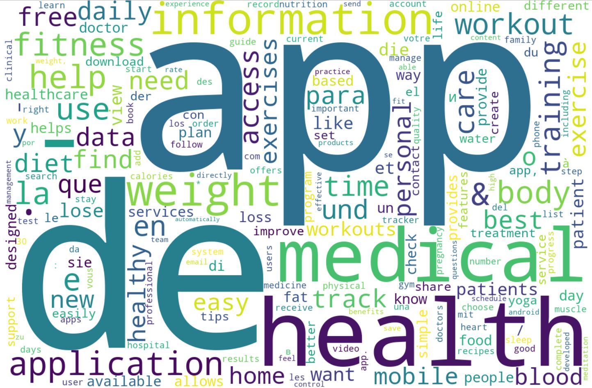
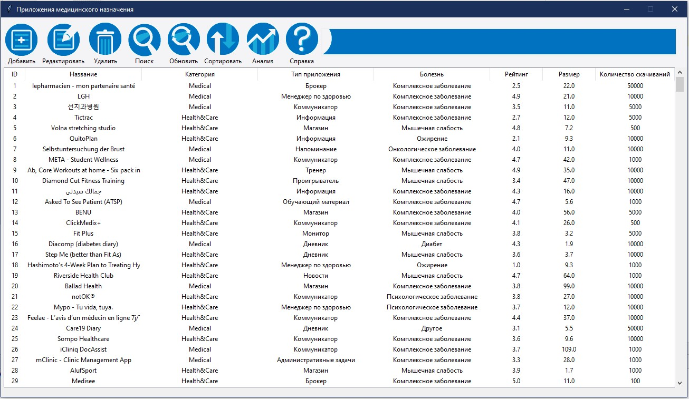
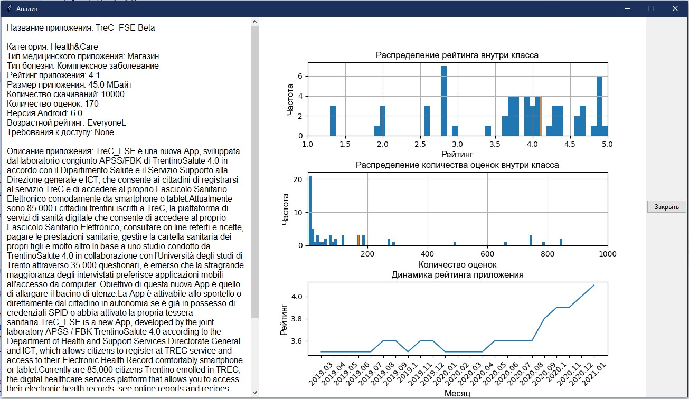

# Medical Apps Classifier

## About project

<b>Medical Apps Classifier</b> is an app that uses ANN to classify medical apps and advanced data analysis algorithms to assess their quality and safety.

## Features

### Database
In this work was created an algorythm that collects all the information in the Google Play applications with tags "medical" and "health&fitness". Then after deep analysis of the obtained database informative parametrs were determened. Then data was processed, filtered and manually 600 samples were classified according to three criteria: a type of the app, a class of the app and a disease that the application is aimed at treating.

### Artificial Neural Network Classifier
Obtained database was divided into training and testing samples which were used in the ANN training. ANN model (to be more precise RNN model) that was perfectly matched to classifications based on the text parametrs processing and optimized during the development managed to classify apps with 80 % accuracy.

### Efficient GUI and data processing
The multifunctional GUI for interaction with obtained database was created. It allows user to find an medical app that requires his unique requirements, get all information about it and analyse it's quality and safety using the advanced statistics methods. 

## Screenshots

  
   

  
   

